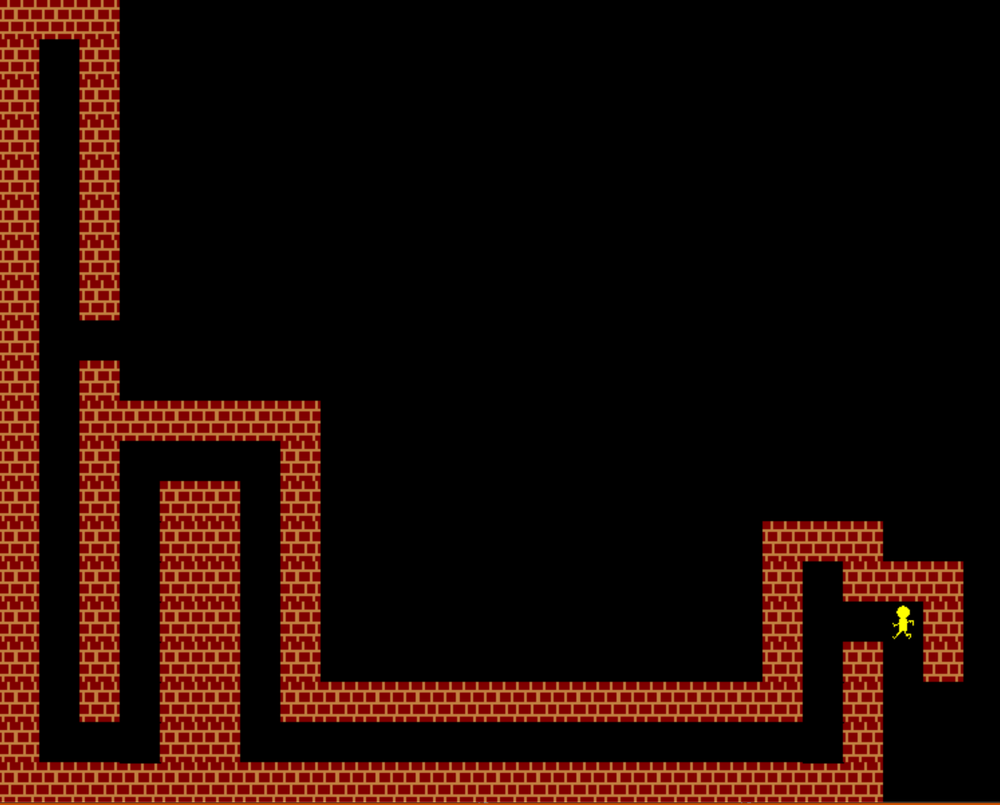
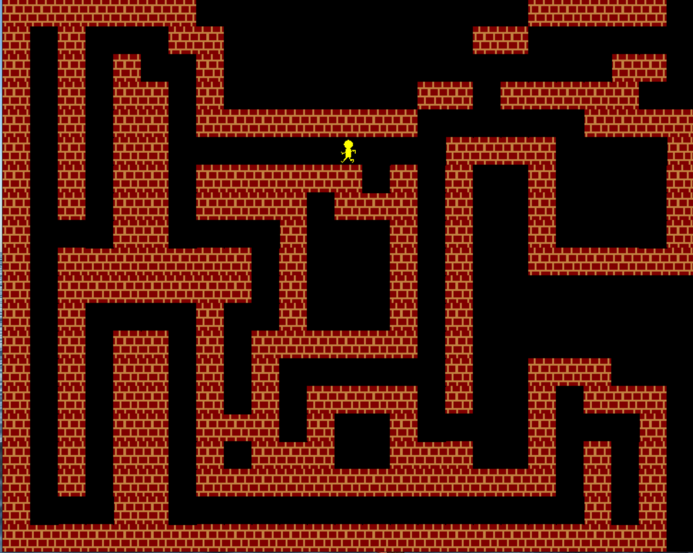

> 一位大一的朋友询问我有关C语言游戏编程的事情，想到自己一年前写的一些的简单的C图形化界面游戏，整理一下。

> 游戏编程其实是一件充满魅力的事情。这个过程不仅是对程技术的考验，更是美丽的艺术创造过程。自己“创造一个自己的游戏”的念头大概就是在初中那些快乐的玩电脑游戏时光中不知不觉生发的吧。

## C_MazeRunner:
### 一个简单迷宫探险游戏。特点是玩家的视野一开始是被限制的，但会在探险过程中不断拓展。目标是找到迷宫的出口。（用一颗五角星标识）
+ 游戏截图

+ how to play: Debug文件下.exe是游戏可执行文件。 
+ 代码编辑：使用vs studio 打开（之后有时间把vs studio的依赖库去掉，使用VScode）
主要代码是My_Test文件夹下的My_Test.cpp.(其实是写得比较幼稚的代码，工程风格也不完善)
+ 依赖库：graphics.h
+ 存在的问题：graphics.h是一个非常基本的库，不能或者难以实现更多复杂的功能。之前尝试写一个2D简化版英雄联盟,还想支持多玩家对战。但是时间不够没有实现多少。进阶工具：
Python: pygame / web端游戏(html5 canvas / javascript ) -> 进阶 webGL 等 -> 游戏引擎 Unity3D 

